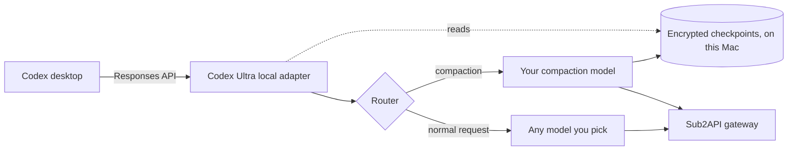

<div align="center">


# Codex Ultra

**How strong is Codex when it can use every model?**

Stop being stuck with one vendor. Bring DeepSeek, Gemini, Claude, Grok, MiniMax,
Kimi and GLM into Codex and use them like native models — automatic compaction,
skills, tool calling and images included.

[](LICENSE)
[](https://www.python.org/)
[](docs/INSTALL.md)
[](#tests)

[简体中文](README.md) · [Let your AI install it](docs/ai-install.en.md) · [Manual install](docs/INSTALL.md) · [Model policy](docs/MODELS.md) · [How it works](#how-it-works) · [Contributing](CONTRIBUTING.md) · [Security](SECURITY.md)

</div>

---

## Install it with one sentence

Paste this into whatever AI you already use — Codex, Claude Code, Cursor, ChatGPT:

> Install Codex Ultra for me: https://raw.githubusercontent.com/noonwake-ai/codex-ultra/main/docs/ai-install.en.md

It reads the install guide, asks you two questions (your gateway address, and which
model should handle compaction), and then does the work. All you do is approve the
system permission prompt.

Rather not let an AI touch your machine? Scroll down — [manual install](#quick-start)
is three commands.

---

## You know this feeling

You are three hundred turns into a task and the context is nearly full.

You switch to DeepSeek to save some money — it is cheaper, it is fast, and it does
the job. Then the compaction request returns 502. Three hundred turns of context
die right there, and you start over.

**That is not your fault.**
Codex's automatic compaction, tool calling and image handling were written around
one vendor's habits from top to bottom. Pointing them at another model is like
handing someone a manual in a language they never learned — they are not slow,
nobody translated for them.

Codex Ultra is the translator. It runs on your own machine and gives every model
Codex's native abilities.

```text
Before                              After
─────────────────────              ─────────────────────
Codex ──────────────────► GPT      Codex ──► Codex Ultra ──► DeepSeek
       (only GPT works)                       └─► Gemini
                                              ├─► Claude
                                              ├─► Grok
                                              ├─► MiniMax
                                              ├─► Kimi
                                              └─► GLM
```

Pick DeepSeek or Gemini in the Codex model list and **run a long task until the
context fills up. Compaction still works, the task continues, nothing returns 502.**

---

## What it genuinely fixes

| Pain | Without Codex Ultra | With Codex Ultra |
|---|---|---|
| **Auto-compaction** | Compaction requests fail after switching models; long tasks die | Compaction runs on a model you choose and the task continues |
| **Tool calling** | The gateway splits tool results away from their images; the model errors out | Calls and results are re-paired and images arrive intact |
| **Reasoning blocks** | Another vendor's encrypted thinking cannot be read | Only public summaries and real task state are forwarded |
| **Context window** | You guess, then either waste capacity or blow the limit | Vendor policy applied automatically; full window when long input is free |
| **Model switching** | Every switch loses the thread | Task state travels with the request |
| **Privacy** | Context handed to an unknown third party | Everything stays on your machine; keys never leave it |

---

## Supported models

Codex Ultra is not tied to a vendor. **Whatever your gateway offers, you can use.**
Built-in policy families:

| Vendor | Slugs | Images | Long context |
|---|---|:---:|:---:|
| **DeepSeek** | `deepseek-*` |  | 1M class |
| **Google** | `gemini-*` | Yes | 1M class |
| **Anthropic** | `claude-*` | Yes | 200K / 1M |
| **xAI** | `grok-*` | Yes | 200K+ |
| **MiniMax** | `minimax-*` `m1-*` `m2-*` | Yes | 1M class |
| **Moonshot** | `kimi-*` `moonshot-*` `k2*` |  | 256K class |
| **Zhipu** | `glm-*` `chatglm*` |  | 128K+ |
| **OpenAI** | `gpt-*` `o1/o3/o4*` | Yes | Native passthrough |

> The table describes **treatment policy** — which routes need image relocation,
> which need vendor-specific thinking filtered, which should use the full window.
> **Real numbers always come from your gateway.** Codex Ultra never invents a model
> your key cannot see and never silently shrinks or inflates an advertised window.
> See [model policy](docs/MODELS.md).

Adding a vendor takes one line in [`model_presets.py`](model_presets.py). PRs welcome.

---

## Quick start

### What you need

1. **A macOS machine** (uses the built-in Keychain and launchd for a per-user service)
2. **Python 3.11 or newer** (`python3 --version`)
3. **A gateway** exposing the OpenAI Responses API plus a `/models` catalog — for example your own [Sub2API](https://github.com/Wei-Shaw/sub2api)
4. **One compaction model**: whichever model you want summarizing context, ideally cheap and fast
5. **[CC Switch](https://github.com/farion1231/cc-switch), optional**: if it manages your providers, Codex Ultra keeps its record in sync so switching providers will not disable the adapter

### Three steps

```bash
git clone https://github.com/noonwake-ai/codex-ultra.git
cd codex-ultra
export CODEX_ULTRA_API_KEY="your-gateway-key"
```

```bash
# 1. Build the catalog (only what your key can see; nothing invented)
python3 build_catalog.py --gateway https://your-gateway.example/v1 --out models.json

# 2. Install the local service (rewrites exactly one base_url, reversible)
python3 install.py \
  --upstream https://your-gateway.example/v1 \
  --compactor-model deepseek-v4-flash \
  --compactor-effort medium

# 3. Open a new Codex chat
```

Then pick your DeepSeek or Gemini model inside Codex and get to work.

<details>
<summary>Curious what gets installed? (click)</summary>

```text
~/Library/Application Support/Codex Ultra/   ← source and venv, mode 700
~/.codex/config.toml                        ← one base_url changed, recorded
~/Library/LaunchAgents/ai.codexultra.local-adapter.plist   ← starts at login
```

```bash
python3 configure.py status     # show the route
python3 configure.py rollback   # restore the endpoint, keep later edits
```

</details>

---

## How it works

Codex Ultra is a local Responses proxy on `127.0.0.1`. Codex believes it is talking
to your gateway; in between sits a translator that understands model differences.



It does four things:

1. **Compaction takeover** — when context fills up, the compaction request is served by the model you chose, producing portable task state.
2. **Encrypted checkpoints** — the result is encrypted locally (AES-GCM, key in the Keychain).
3. **Tool-image repair** — when a gateway splits calls, results and images apart, they are re-paired so the image reaches the model intact.
4. **Catalog building** — windows, image support and reasoning levels are filled in per vendor so Codex schedules correctly.

Design rule: **Codex Ultra never modifies your credentials and never touches your
chat history.** It forwards and reshapes requests, nothing more.

---

## Tests

```bash
python3 -m unittest discover -s . -p 'test_*.py'
```

Covers compaction handoff, encrypted checkpoints across restarts, tamper refusal,
image pairing, media history, gateway failures, catalog policy, endpoint rewrite
and rollback. Everything runs offline and spends no model credits.

---

## FAQ

<details>
<summary><b>Does it steal my API key?</b></summary>

No. The key only travels between processes on your machine. It is never written
into source, logs or compaction output, and the catalog builder actively refuses
to write a file that looks like it contains a credential.
</details>

<details>
<summary><b>Where does my data go after compaction?</b></summary>

Compaction results are stored encrypted on your Mac, with the key in the system
Keychain. `configure.py rollback` restores the network endpoint only and
deliberately leaves those encrypted records in place, because older chats still
need them.
</details>

<details>
<summary><b>Why default to the full context window?</b></summary>

Because a number of vendors charge nothing extra for long input, DeepSeek among
them at the time of writing.
If it costs the same, there is no reason to throw away half the model's capacity.
For vendors that do surcharge long context, switch the policy to `standard` with a
cap; see [model policy](docs/MODELS.md).
</details>

<details>
<summary><b>Windows or Linux?</b></summary>

The adapter itself is plain Python and runs anywhere. The current installer uses
macOS Keychain and launchd, so one-command setup covers macOS only. Elsewhere you
can run `adapter.py` by hand; service-management PRs are welcome.
</details>

<details>
<summary><b>Does it conflict with CC Switch?</b></summary>

No. CC Switch decides *which provider* you use; Codex Ultra decides *how that
provider is adapted*. Both touch the same `base_url`, so the installer updates the
CC Switch record too, preventing a later provider switch from silently dropping
the adapter.
</details>

---

## Credits

Codex Ultra stands on two excellent open source projects:

- **[Sub2API](https://github.com/Wei-Shaw/sub2api)** — one gateway for every model subscription
- **[CC Switch](https://github.com/farion1231/cc-switch)** — cross-platform provider switcher

Codex Ultra neither bundles nor modifies their code; it works alongside them.

## License

[MIT](LICENSE) © NoonWake AI
