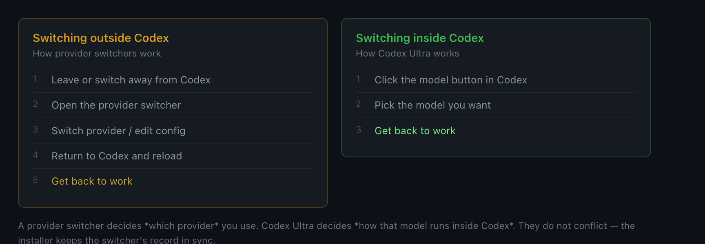
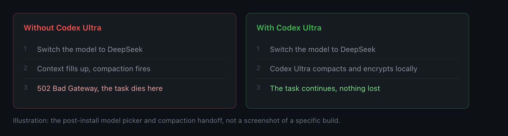
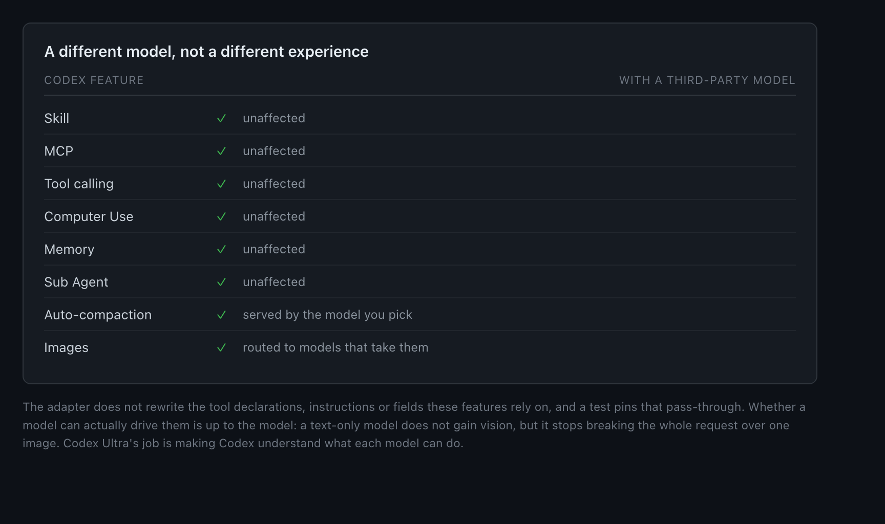
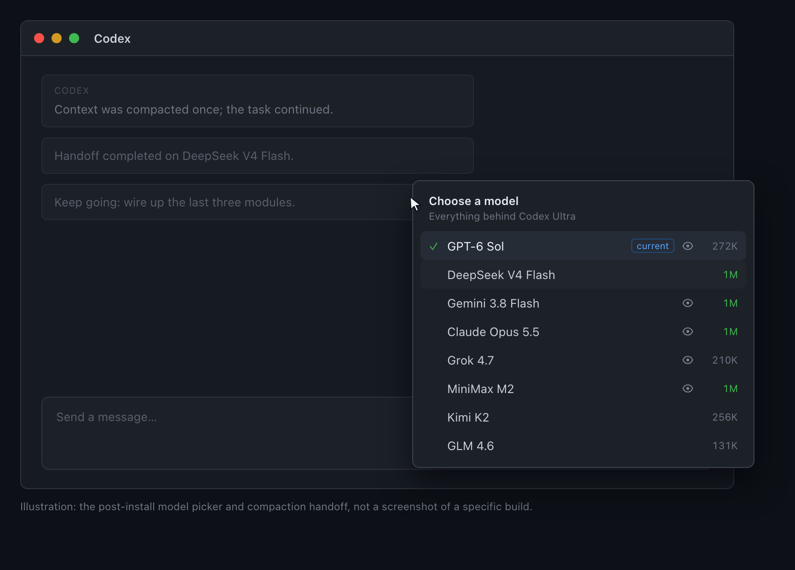
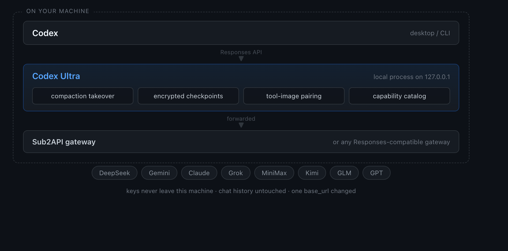
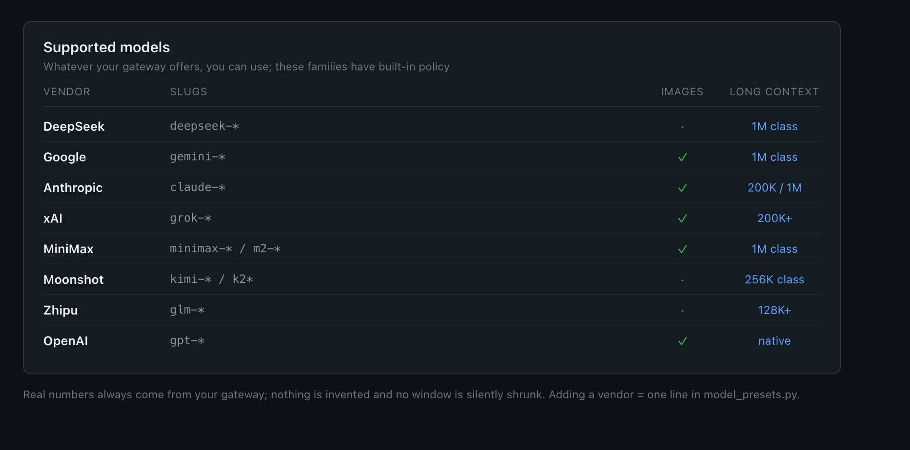
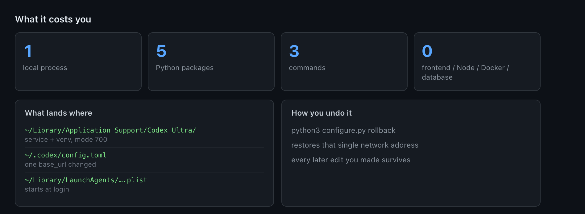
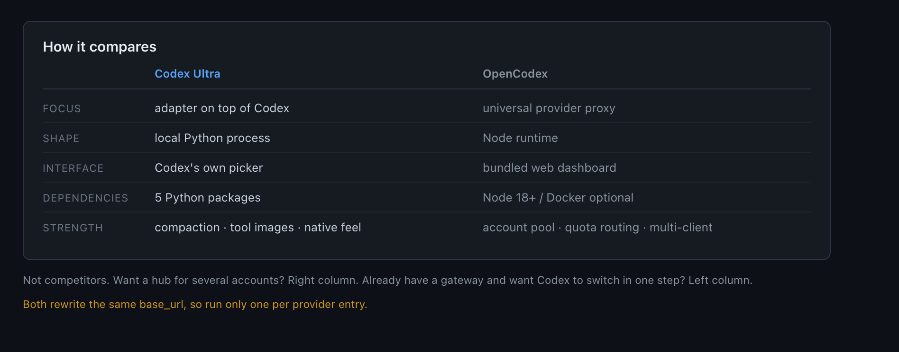

<div align="center">


# Codex Ultra

**How strong is Codex when it can use every model?**

Stop being stuck with one vendor. Bring DeepSeek, Gemini, Claude, Grok, MiniMax,
Kimi and GLM into Codex and use them like native models.

[](LICENSE)
[](https://www.python.org/)
[](docs/INSTALL.md)
[](#tests)

[简体中文](README.md) · [Let your AI install it](docs/ai-install.en.md) · [Manual install](docs/INSTALL.md) · [Model policy](docs/MODELS.md) · [Contributing](CONTRIBUTING.md) · [Security](SECURITY.md)

</div>

---

## Install it with one sentence

Paste this into whatever AI you already use — Codex, Claude Code, Cursor, ChatGPT:

> Install Codex Ultra for me: https://raw.githubusercontent.com/noonwake-ai/codex-ultra/main/docs/ai-install.en.md

It reads the guide, asks you two questions, and does the work. You approve one
system permission prompt.

Rather not let an AI touch your machine? [Manual install](docs/INSTALL.md) is three commands.

---

## See what it does

**Switch models inside Codex** — no exiting, no editing config, no reloading.



**Run a long task until context fills up — compaction still works.** No 502, no lost history.



**Every Codex ability still applies**, on the new model.



What shows up in the picker is whatever your gateway offers:



---

## Images in long sessions

Video work, image dumps and screenshot debugging push a request past 20-40 MB quickly, and
an image's *size* is not its *token cost*, so bytes get their own layer:

- **Transcode (on, free)**: re-encodes only -- resolution, cropping and `detail` never move,
  and a lossy candidate has to pass two fidelity gates or the original bytes are kept.
- **Budget transcription / pre-warm (off, paid per image)**: the **oldest frames only** become a
  text description plus a path to the original, while the newest turn keeps real pixels. These
  layers call your gateway and spend your credits, so they stay off until you ask.

An image is paid for once (cached by content hash), the cache is bounded, and `/health` reports
the whole picture. See [the image byte layer](docs/MEDIA.en.md).

## Where it sits



---

## Supported models

Whatever your gateway offers, you can use. These families have built-in policy:



Adding a vendor is one line in [`model_presets.py`](model_presets.py). Details in
[model policy](docs/MODELS.md).

A third-party model's hidden thinking is routed by the tag its own ciphertext carries: **the
vendor that minted it gets it back, everyone else keeps the readable summary.** Doubao (Ark) and
Claude chains therefore survive a multi-round tool loop instead of being re-derived every turn.

---

## Deployment cost



---

## How it compares



---

## Quick start

**You need:** macOS 13+, Python 3.11+ (macOS ships 3.9, which is too old —
`brew install python@3.12`), a gateway address, and one compaction model.
[CC Switch](https://github.com/farion1231/cc-switch) is optional.

```bash
git clone https://github.com/noonwake-ai/codex-ultra.git
cd codex-ultra
export CODEX_ULTRA_API_KEY="your-gateway-key"

# 1. Build the model catalog (only what your key can see)
python3 build_catalog.py --gateway https://your-gateway.example/v1 --out models.json

# 2. Install (rewrites exactly one base_url, reversible)
python3 install.py --upstream https://your-gateway.example/v1 \
  --compactor-model deepseek-v4-flash --compactor-effort medium

# 3. Open a new Codex chat
```

Rollback: `python3 configure.py rollback` — restores that single network address.

Full details in [install](docs/INSTALL.md).

---

## Tests

```bash
python3 -m unittest discover -s . -p 'test_*.py'
```

301 offline tests, no paid requests. Covers compaction handoff, encrypted
checkpoints across restarts, tamper refusal, image pairing, gateway failures,
catalog policy, endpoint rewrite and rollback. CI runs 3.11 / 3.12 / 3.13.

---

## FAQ

<details><summary><b>Does it steal my API key?</b></summary>

No. The key only moves between processes on your machine — never written to disk,
logs or compaction output.
</details>

<details><summary><b>Where does compacted data live?</b></summary>

Encrypted on your Mac, with the key in the system Keychain. `rollback` restores
the network endpoint only and leaves those records alone — older chats need them.
</details>

<details><summary><b>Sub-agents answer "no task payload" on third-party models?</b></summary>

Fixed, in two cases. A team message carried its body in a content part named
`encrypted_content`: OpenAI's native route decodes it, a routed provider only understands
plain text, so the sub-agent saw the `Payload:` header and nothing else.

- Readable body: inlined as ordinary text before forwarding, order preserved, readable by any
  model.
- Sealed body (native ciphertext produced only on the OpenAI route): kept as-is toward a native
  route; toward a third-party route the readable header is kept and the body becomes an explicit
  notice that the payload cannot be read here and should be resent as plain text.

Two further shapes that silently lost their body are covered too: an empty
`encrypted_content` part (header arrived, body did not) and ciphertext hidden inside the
text part; that notice keeps the header only and never pastes ciphertext into the prompt.
A readable body next to sealed state is still delivered. The compaction route
(`/responses/compact`) deliberately keeps sealed state untouched — the compactor runs on
this service's own configured route, and rewriting could overwrite bytes its upstream can
still read.

See `test_agent_messages.py` (32 tests).
</details>

<details><summary><b>Will an image-heavy thread blow up the next upload after compaction?</b></summary>

It could, so there is a guard now. The checkpoint travels back on every following turn, and
with a long image history it can be larger than the upload limit — the client can compact
and then never send another message. The adapter now sizes the checkpoint before handing it
back: the pixel-preserving transcoder first, then (only as far as needed) the oldest frames
become vision transcriptions — the same trade and the same re-read path the byte budget
already uses. If it still does not fit it raises, and the client keeps its original history
instead of receiving a checkpoint it can never upload. Default cap: 24 MiB, tune with
`compaction_checkpoint_bytes`, set 0 to disable.

</details>

<details><summary><b>Can the transcode cache hand me someone else's frame?</b></summary>

Not any more. Cache identity grew from "source bytes + webp allowed" to "source bytes +
quality + source MIME + pipeline fingerprint"; entries carry a content digest that is
verified on read, and writes use a process/thread-scoped temporary name (two processes used
to share one `.tmp` name and could publish each other's bytes). Stale version directories and
orphan temporaries are swept during pruning.

</details>

<details><summary><b>Why use the full context window by default?</b></summary>

Several vendors charge nothing extra for long input. If it costs the same, do not
throw away half the capacity. Surcharged tiers can use the `standard` policy with a
cap — see [model policy](docs/MODELS.md).
</details>

<details><summary><b>Windows or Linux?</b></summary>

The adapter is plain Python and runs anywhere. One-command install uses macOS
Keychain + launchd, so elsewhere run `adapter.py` by hand; service-management PRs
are welcome.
</details>

<details><summary><b>Does it conflict with CC Switch?</b></summary>

No. It decides *which provider* you use; Codex Ultra decides *how that model runs
inside Codex*. The installer keeps its record in sync so a later switch will not
drop the adapter.
</details>

<details><summary><b>What if my gateway does not decode zstd?</b></summary>

The adapter re-compresses the history it forwards, which matters most on slow links.
If the gateway rejects the compressed upload, it resends uncompressed automatically;
after a few rejections it pauses compression and retries later. To turn compression
off deliberately, set `"upstream_encoding": "identity"` in `config.json` and restart.
</details>

---

## Credits

Standing on two excellent open source projects:
[Sub2API](https://github.com/Wei-Shaw/sub2api) (model gateway) and
[CC Switch](https://github.com/farion1231/cc-switch) (provider switcher). Neither
is bundled or modified.

## License

[LGPL-3.0](LICENSE) © NoonWake AI · free to use including commercially · share
changes only when you distribute a modified version · your own code is unaffected

Full text in [LICENSE](LICENSE), GPL-3.0 in [GPL-3.0.txt](GPL-3.0.txt), copyright
notice in [NOTICE](NOTICE).
