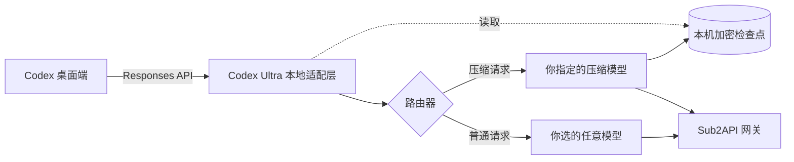

<div align="center">


# Codex Ultra

**当 Codex 可以使用所有模型时，有多强。**

别再一辈子只抱着 GPT 了。DeepSeek、Gemini、Claude、Grok、MiniMax、Kimi、GLM——
接进来，然后在 Codex 里当原生模型用：自动压缩、Skill、工具调用、图片，一样不少。

[](LICENSE)
[](https://www.python.org/)
[](docs/INSTALL.md)
[](#测试)

[English](README.en.md) · [交给 AI 安装](docs/ai-install.md) · [手动安装](docs/INSTALL.md) · [模型能力表](docs/MODELS.md) · [工作原理](#工作原理) · [常见问题](#常见问题) · [参与贡献](CONTRIBUTING.md) · [安全](SECURITY.md)

</div>

---

## 一句话装好

把下面这句原样发给你正在用的 AI——Codex、Claude Code、Cursor、ChatGPT 都行：

> 帮我安装 Codex Ultra：https://raw.githubusercontent.com/noonwake-ai/codex-ultra/main/docs/ai-install.md

它会自己读安装说明、问你两个问题（网关地址、用哪个模型做压缩），然后把活干完。
你要做的只有一件事：在它要系统权限的时候点一下同意。

不想让 AI 碰你的电脑？往下翻，[手动安装](#快速开始)也就三条命令。

---

## 你有没有过这种时刻

任务已经跑到第三百轮，上下文快满了。

你想切到 DeepSeek 省点钱——毕竟它便宜、够快、也能干活。
结果压缩请求直接 502，几百轮的上下文断在那儿，只能从头再来。

**这不是你的问题。**
Codex 的自动压缩、工具调用、图片处理，从头到尾都是照着 GPT 的脾气写的。
换个模型过去，就像让一个只会中文的人去读英文说明书——不是他笨，是没人给他翻译。

Codex Ultra 就是那个翻译。它跑在你自己电脑上，把 Codex 的原生能力补齐给每一个模型。

```text
你现在的样子                        用了 Codex Ultra 之后
─────────────────────              ─────────────────────
Codex ──────────────────► GPT      Codex ──► Codex Ultra ──► DeepSeek
       （只有 GPT 顺）                             └─► Gemini
                                              ├─► Claude
                                              ├─► Grok
                                              ├─► MiniMax
                                              ├─► Kimi
                                              └─► GLM
```

装完之后，你在 Codex 的模型列表里直接选 DeepSeek 或者 Gemini，
**长任务跑到上下文满，它照常自动压缩、接着干活**，不会 502，不会丢任务。

---

## 它究竟替你修好了什么

| 痛点 | 没有 Codex Ultra | 有 Codex Ultra |
|---|---|---|
| **自动压缩** | 换模型后压缩请求 502，长任务直接断 | 用你指定的模型做压缩，任务无缝接续 |
| **工具调用** | 上游网关把工具结果和图片拆散，模型直接报错 | 自动修复调用/结果配对，图片完整送达 |
| **思考过程** | 别家的加密思考块塞过去，模型读不懂 | 只留公开摘要和真实任务状态 |
| **上下文窗口** | 不知道每个模型能装多少，要么浪费要么爆 | 按厂商策略自动配置，不额外收长上下文费就用满 |
| **切换模型** | 换一次模型，历史就废一次 | 任务状态跟着走，接着干 |
| **隐私** | 把上下文交给不明第三方 | 全程在你本机，密钥不出本机 |

---

## 支持的模型

Codex Ultra 不绑定厂商，**你网关里有什么，你就能用什么**。
已内置策略的厂商家族：

| 厂商 | 代表模型 | 图片 | 长上下文 |
|---|---|:---:|:---:|
| **DeepSeek** | `deepseek-*` |  | 100 万级别 |
| **Google** | `gemini-*` | 是 | 100 万级别 |
| **Anthropic** | `claude-*` | 是 | 20 万 / 100 万 |
| **xAI** | `grok-*` | 是 | 20 万以上 |
| **MiniMax** | `minimax-*` `m1-*` `m2-*` | 是 | 100 万级别 |
| **Moonshot** | `kimi-*` `moonshot-*` `k2*` |  | 25 万级别 |
| **Zhipu** | `glm-*` `chatglm*` |  | 12 万以上 |
| **OpenAI** | `gpt-*` `o1/o3/o4*` | 是 | 原生直通 |

> 表格里填的是**处理策略**：哪种路由需要图片搬运、哪种需要过滤加密思考块、哪种用满窗口。
> **具体数值永远以你的网关为准**——Codex Ultra 不会凭空给你一个你的 key 看不到的模型，
> 也不会擅自缩小或放大网关给的窗口。细节见 [模型能力表](docs/MODELS.md)。

想加一个厂商？改 [`model_presets.py`](model_presets.py) 里的一行就够了，欢迎 PR。

---

## 快速开始

### 你需要准备什么

1. **一台 macOS 电脑**（用系统自带的 Keychain 和 launchd 守护进程，随登录自启）
2. **Python 3.11 或更高**（`python3 --version` 看一眼）
3. **一个网关地址**：任何实现了 OpenAI Responses 接口、并且有 `/models` 目录的网关，比如你自己跑的 [Sub2API](https://github.com/Wei-Shaw/sub2api)
4. **至少一个压缩模型**：Codex Ultra 用它来帮你压缩上下文，选一个你额度充足、反应快的
5. **[CC Switch](https://github.com/farion1231/cc-switch) 可选**：它在管你的供应商配置的话，Codex Ultra 会顺带同步，切换供应商时不会被覆盖

### 三步装完

```bash
git clone https://github.com/noonwake-ai/codex-ultra.git
cd codex-ultra
export CODEX_ULTRA_API_KEY="你的网关密钥"
```

```bash
# 1. 生成模型目录（读到什么就有什么，不会替你编模型）
python3 build_catalog.py --gateway https://你的网关地址/v1 --out models.json

# 2. 安装本地服务（只改配置里的一个 base_url，随时可回滚）
python3 install.py \
  --upstream https://你的网关地址/v1 \
  --compactor-model deepseek-v4-flash \
  --compactor-effort medium

# 3. 重开一个 Codex 对话
```

装完之后，在 Codex 里选你的 DeepSeek 或 Gemini，直接干活。

<details>
<summary>想先看看会装成什么样？（点开）</summary>

```text
~/Library/Application Support/Codex Ultra/   ← 服务本体和依赖，权限 700
~/.codex/config.toml                        ← 只改一个 base_url，备份在案
~/Library/LaunchAgents/ai.codexultra.local-adapter.plist   ← 随登录自启
```

```bash
# 看状态
python3 configure.py status

# 一键回滚，只还原端点，你之后的其它改动一律保留
python3 configure.py rollback
```

</details>

---

## 工作原理

Codex Ultra 是一个跑在 `127.0.0.1` 上的本地 Responses 代理。Codex 以为自己在跟网关说话，
其实中间多了个懂模型的翻译官。



它做了四件事：

1. **压缩接管** —— 上下文满了，Codex 发的压缩请求被接管，用你指定的模型生成一份可移植的任务状态。
2. **加密检查点** —— 压缩结果在本机加密（AES-GCM，密钥在 Keychain），别人拿到也读不出来。
3. **工具图片修复** —— 发现网关把工具调用、结果、图片拆散了，就重新配对，图片完整送达模型。
4. **模型目录构建** —— 按厂商策略给你的目录补上窗口、图片、思考档位，让 Codex 正确调度。

关键设计：**Codex Ultra 从不修改你的密钥，也不碰你的聊天记录**。
它只做请求转发和格式转换。

---

## 测试

```bash
python3 -m unittest discover -s . -p 'test_*.py'
```

覆盖内容：压缩接续、加密检查点跨重启、防篡改、图片配对、媒体历史、
网关错误处理、目录策略、端点改写与回滚。全部离线运行，不发一次付费请求。

---

## 常见问题

<details>
<summary><b>会偷我的 API Key 吗？</b></summary>

不会。密钥只在你本机的进程间传递，不写入源码、不写日志、不进压缩结果。
目录构建器还会主动扫描输出，发现疑似密钥就直接拒绝写文件。
</details>

<details>
<summary><b>压缩之后我的数据去哪了？</b></summary>

压缩结果加密存在你的 Mac 上，密钥在系统 Keychain 里，只有本机能解。
`configure.py rollback` 只还原网络端点，**不会删除**这些加密记录——因为老对话还要靠它读取。
</details>

<details>
<summary><b>为什么默认要用满上下文窗口？</b></summary>

因为不少厂商的长上下文并不额外计费（DeepSeek 目前就是如此）。
既然不用多花钱，
就没必要人为砍一半，白白浪费模型能力。
如果某个厂商的长上下文是加价档，把策略改成 `standard` 并设一个上限就行，
见 [模型能力表](docs/MODELS.md)。
</details>

<details>
<summary><b>支持 Windows / Linux 吗？</b></summary>

核心适配层是纯 Python，能跑。但当前版本的安装器用了 macOS 的 Keychain 和 launchd，
所以一键安装只覆盖 macOS。Windows / Linux 用户可以先手动跑 `adapter.py`，
欢迎 PR 补上服务管理。
</details>

<details>
<summary><b>和 CC Switch 会冲突吗？</b></summary>

不会。CC Switch 管的是"用哪个供应商"，Codex Ultra 管的是"这个供应商怎么被模型适配"。
两者改的是同一个 `base_url`，所以安装时会同步 CC Switch 里的记录，
避免你下次切供应商时把本地适配层切没了。
</details>

---

## 致谢

Codex Ultra 站在两个优秀开源项目的肩膀上：

- **[Sub2API](https://github.com/Wei-Shaw/sub2api)** —— 一站式模型中转网关，把各家模型统一成一套接口
- **[CC Switch](https://github.com/farion1231/cc-switch)** —— 跨平台供应商切换器，管好你的 API 配置

Codex Ultra 不包含也不修改它们的代码，只是跟它们配合工作。

## 许可证

[MIT](LICENSE) © NoonWake AI
