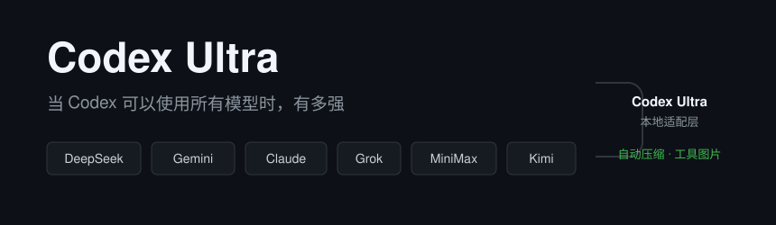
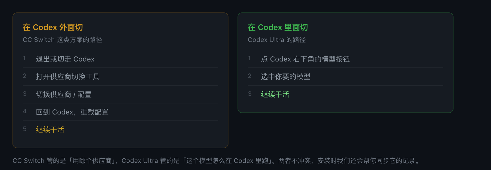
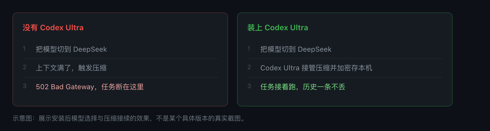
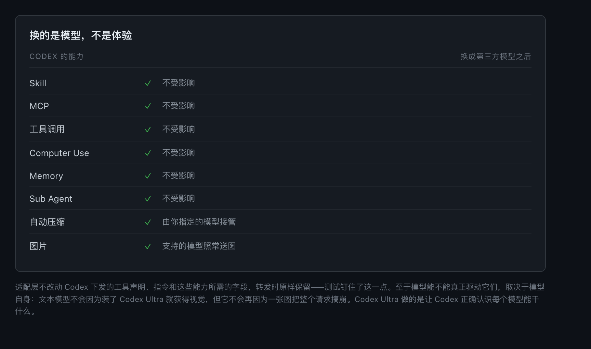
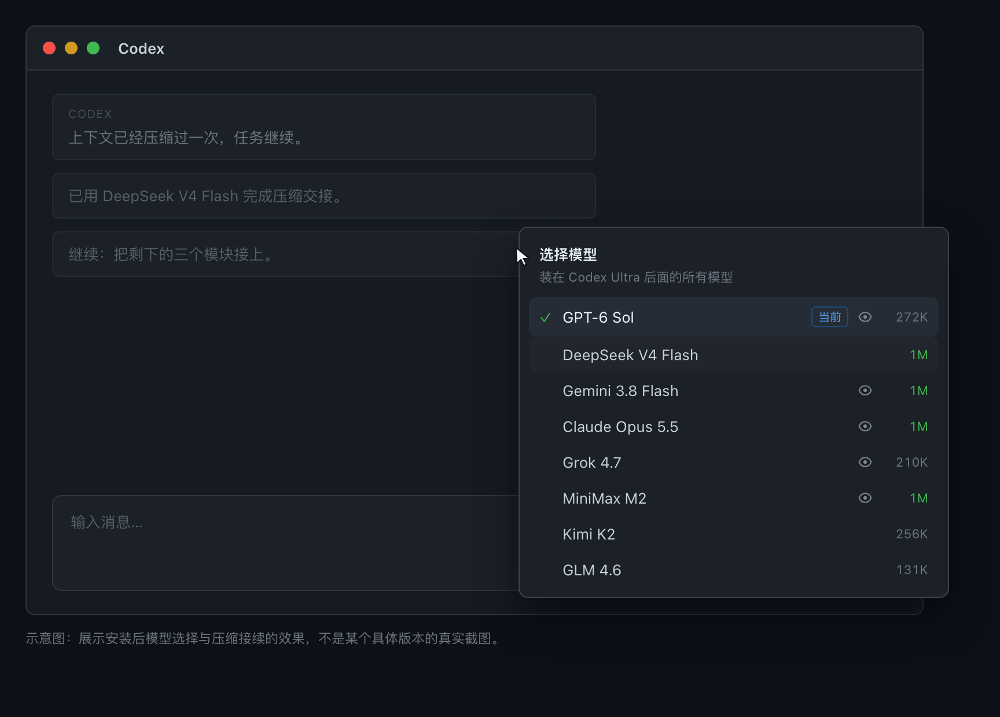
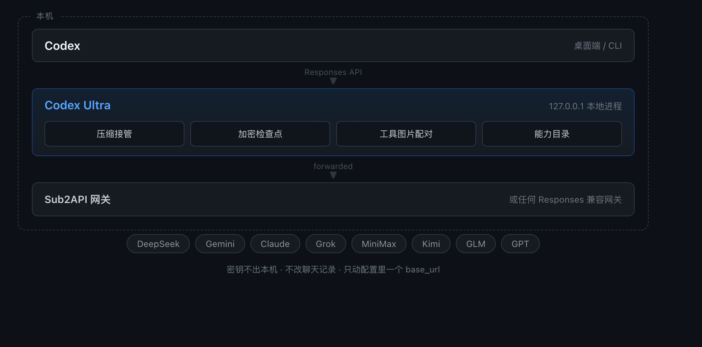
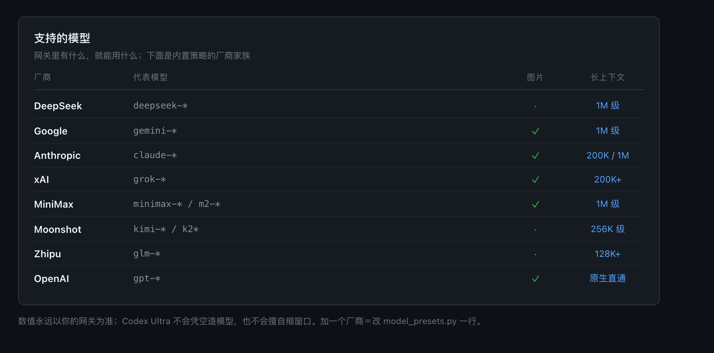
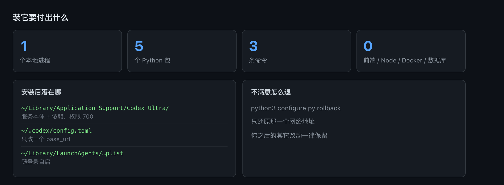
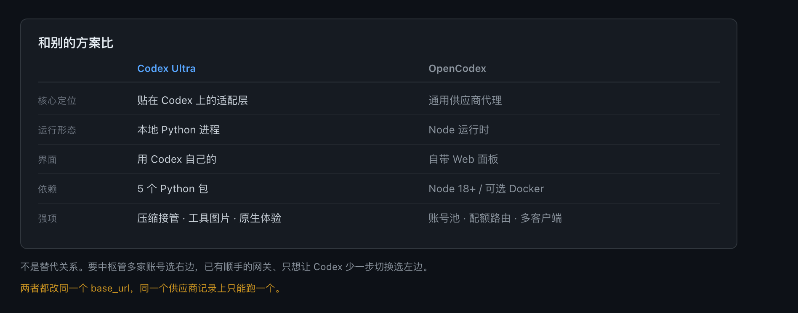

<div align="center">



# Codex Ultra

**当 Codex 可以使用所有模型时，有多强。**

不再只抱着 GPT。DeepSeek、Gemini、Claude、Grok、MiniMax、Kimi、GLM——
接进来，在 Codex 里当原生模型用。

[](LICENSE)
[](https://www.python.org/)
[](docs/INSTALL.md)
[](#测试)

[English](README.en.md) · [交给 AI 安装](docs/ai-install.md) · [手动安装](docs/INSTALL.md) · [模型能力表](docs/MODELS.md) · [参与贡献](CONTRIBUTING.md) · [安全](SECURITY.md)

</div>

---

## 一句话装好

把下面这句原样发给你正在用的 AI——Codex、Claude Code、Cursor、ChatGPT 都行：

> 帮我安装 Codex Ultra：https://raw.githubusercontent.com/noonwake-ai/codex-ultra/main/docs/ai-install.md

它会自己读说明、问你两个问题，然后干完。你只需在它要系统权限时点一下同意。

不想让 AI 碰你的电脑？[手动安装](docs/INSTALL.md)是三条命令。

---

## 看它做了什么

**在 Codex 里直接切模型**，不用退出、不用改配置、不用回来重载。



**长任务跑到上下文满，压缩照常工作**，不 502、不丢历史。



**Codex 的能力一个不少**，全部落到新模型上。



模型下拉框里有什么，取决于你的网关：



---

## 图片与长会话：字节也要管

剪视频、传素材、截图调试这类场景，一个会话很容易把请求体堆到 20–40 MB。图片的「体积」和
「token」是两回事，所以这一层单独管字节：

- **转码（默认开，不花钱）**：只换更小的编码，分辨率、裁剪、`detail` 全都不动；有损候选要过两道
  保真闸门，过不了就退回无损或原图。
- **预算转写 / 后台预热（默认关，按图付费）**：超预算时把**最老的几张**图换成文字描述 + 原图路径，
  最新的图永远保留像素。这两层会调用你自己的网关、花你自己的额度，所以默认不替你做决定。

一张图只付一次（按内容哈希缓存），缓存有上限，`/health` 上有全套计数。
完整口径、开关方式、缓存策略见 [图片字节层](docs/MEDIA.md)。

## 它站在哪



---

## 支持的模型

网关里有什么，就能用什么。下面是内置策略的厂商家族：



想加一个厂商？改 [`model_presets.py`](model_presets.py) 一行。细节见[模型能力表](docs/MODELS.md)。

---

## 部署成本



---

## 和别的方案比



---

## 快速开始

**需要：** macOS 13+、Python 3.11+（macOS 自带 3.9 太旧，`brew install python@3.12`）、
一个网关地址、一个压缩模型。[CC Switch](https://github.com/farion1231/cc-switch) 可选。

```bash
git clone https://github.com/noonwake-ai/codex-ultra.git
cd codex-ultra
export CODEX_ULTRA_API_KEY="你的网关密钥"

# 1. 生成模型目录（读到什么就有什么）
python3 build_catalog.py --gateway https://你的网关/v1 --out models.json

# 2. 安装（只改配置里一个 base_url，随时可回滚）
python3 install.py --upstream https://你的网关/v1 \
  --compactor-model deepseek-v4-flash --compactor-effort medium

# 3. 重开一个 Codex 对话
```

回滚：`python3 configure.py rollback` —— 只还原那个网络地址。

完整说明见 [安装与部署](docs/INSTALL.md)。

---

## 测试

```bash
python3 -m unittest discover -s . -p 'test_*.py'
```

228 项离线测试，不发付费请求。覆盖压缩接续、加密检查点跨重启、防篡改、图片配对、
网关失败、目录策略、端点改写与回滚。CI 跑 Python 3.11 / 3.12 / 3.13。

---

## 常见问题

<details><summary><b>会偷我的 API Key 吗？</b></summary>

不会。密钥只在本机进程间传递，不落盘、不进日志、不进压缩结果。
</details>

<details><summary><b>压缩后的数据在哪？</b></summary>

加密存在你的 Mac 上，密钥在系统 Keychain。`rollback` 只还原网络地址，
不删这些记录——老对话还要靠它读取。
</details>

<details><summary><b>为什么默认用满上下文窗口？</b></summary>

不少厂商长上下文不额外计费。既然不加钱，没必要砍一半。
加价档可以用 `standard` 策略设上限，见[模型能力表](docs/MODELS.md)。
</details>

<details><summary><b>Windows / Linux 能用吗？</b></summary>

适配层是纯 Python，能跑。但一键安装用的是 macOS Keychain + launchd，
其他系统需手动跑 `adapter.py`，欢迎 PR 补服务管理。
</details>

<details><summary><b>和 CC Switch 冲突吗？</b></summary>

不冲突。它管「用哪个供应商」，Codex Ultra 管「这个模型怎么在 Codex 里跑」。
安装时会同步它的记录，避免下次切换把适配层切没了。
</details>

<details><summary><b>网关不认 zstd，上传会不会被压坏？</b></summary>

适配层把发出去的历史重新压缩（慢网络上这一项差好几倍）。网关不认的时候，
它会自动换成不压缩的方式重发一次；连续几次之后暂停压缩并定期回试。
想直接关掉，把 `config.json` 里的 `upstream_encoding` 改成 `"identity"` 再重启。
</details>

---

## 致谢

站在两个优秀开源项目上：[Sub2API](https://github.com/Wei-Shaw/sub2api)（模型中转网关）、
[CC Switch](https://github.com/farion1231/cc-switch)（供应商切换器）。
不包含也不修改它们的代码。

## 许可证

[LGPL-3.0](LICENSE) © NoonWake AI · 随便用（含商用）· 分发改动才需开源改动 · 不传染你的代码

完整文本见 [LICENSE](LICENSE)，GPL-3.0 全文见 [GPL-3.0.txt](GPL-3.0.txt)，版权声明见 [NOTICE](NOTICE)。
